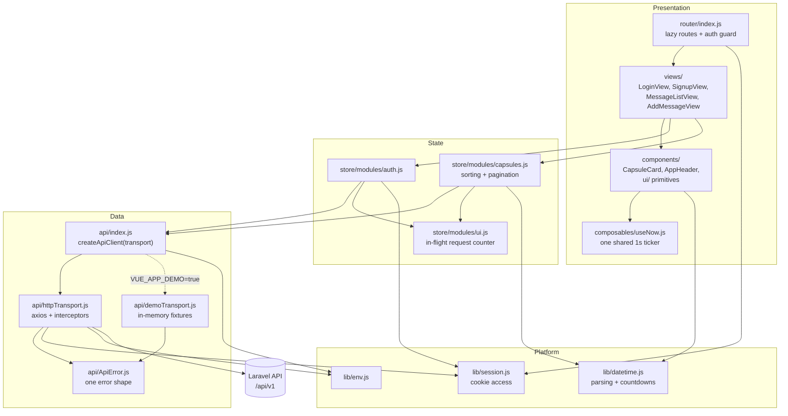
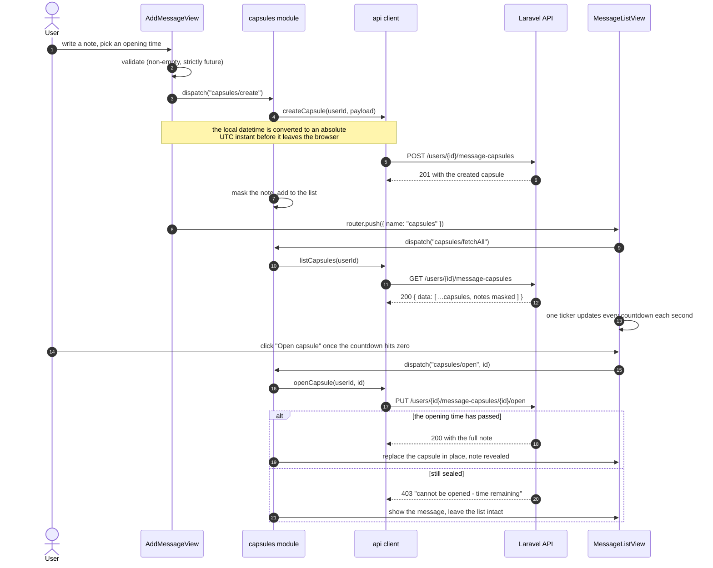

# Time Capsule — Vue 3 client

A small single-page app for writing a note to your future self. You pick a
moment, the note is sealed, and until that moment passes the API only ever
returns the first four characters of it — the rest never reaches the browser.
This repository is the frontend; it talks to the Laravel API in
[`dealers-united-backend`](https://github.com/Chsaleem31/dealers-united-backend)
(Fortify for auth, Sanctum tokens for everything else).

## Screenshots

Captured with Playwright at 1440×900 against the app running locally in demo
mode (`npm run serve:demo`), which serves the fixture data in
`src/api/demoFixtures.js` instead of calling the API.

| The capsule list — sealed, unlockable and opened side by side |
| --- |
|  |

| A capsule just after it was opened |
| --- |
|  |

| Sealing a new capsule |
| --- |
|  |

| Sign-in | The list at 390px |
| --- | --- |
|  |  |

## Architecture

The app is layered, and the dependencies only ever point downwards: a view may
use the store, the store uses the API client, and the API client uses a
transport. Nothing below a layer knows what is above it, and no component
imports axios or builds a URL.



The pattern is a **container/presentational split with an injected data layer**.
Views own form state and navigation; Vuex modules own everything that outlives a
route change; the API client owns URLs and response shapes. `createAppStore()`
and `createApiClient()` both take their dependencies as arguments, which is what
lets the unit suite run the real actions against a fixture backend.

## Sealing and opening a capsule



## Quickstart

The fastest way to see the app is demo mode, which needs no backend:

```bash
npm install
npm run serve:demo     # http://localhost:8080 — in-memory fixture data
```

Sign in with any email and password; demo mode accepts anything non-empty.

Against the real API:

```bash
cp .env.example .env   # then point VUE_APP_API_BASE_URL at your backend
npm install
npm run serve
```

## Configuration

All configuration is build-time: Vue CLI inlines `VUE_APP_*` variables into the
bundle, so changing one means rebuilding, not restarting.

| Variable | Required | Default | Purpose |
| --- | --- | --- | --- |
| `VUE_APP_API_BASE_URL` | no | `http://localhost/api/v1/` | Base URL of the Laravel API, including the `v1` prefix. A trailing slash is added if you omit one. |
| `VUE_APP_DEMO` | no | `false` | When true, the in-memory fixture transport replaces HTTP. No request leaves the browser. |
| `VUE_APP_PAGE_SIZE` | no | `8` | Capsules rendered per page in the list view. |
| `WEB_PORT` | no | `8640` | Host port published by `docker-compose.yml`. Compose only. |

### API endpoints used

| Method | Path | Used by |
| --- | --- | --- |
| `POST` | `/api/v1/register` | `auth/signup` — returns `{ user, token }` |
| `POST` | `/api/v1/login` | `auth/login` — returns `{ user, token }` |
| `GET` | `/api/v1/user` | `auth/hydrate`, after a full page reload |
| `GET` | `/api/v1/users/{id}/message-capsules` | `capsules/fetchAll` — returns `{ data: [...] }` |
| `POST` | `/api/v1/users/{id}/message-capsules` | `capsules/create` |
| `PUT` | `/api/v1/users/{id}/message-capsules/{capsuleId}/open` | `capsules/open` |

## Development

```bash
npm run serve          # dev server against the configured API
npm run serve:demo     # dev server with fixture data, no backend needed
npm run build          # production bundle into dist/
npm test               # Vitest, 123 unit tests
npm run test:watch     # the same suite in watch mode
npm run test:coverage  # V8 coverage report
npm run lint           # ESLint (vue3-recommended), auto-fixing
npm run lint:check     # ESLint without --fix, for CI
npm run format         # Prettier
```

No test touches the network: `tests/setup.js` replaces `fetch` and
`XMLHttpRequest` with stubs that throw, and the store tests run against the same
in-memory transport demo mode uses.

### Docker

```bash
docker compose build
docker compose up -d   # http://localhost:8640
```

Multi-stage build (deps → webpack build → nginx), runs as the unprivileged
`nginx` user on port 8080 with a read-only root filesystem and a `/healthz`
healthcheck. Because `VUE_APP_*` is compile-time, the API URL is a **build
argument**:

```bash
docker compose build --build-arg VUE_APP_API_BASE_URL=https://api.example.com/api/v1/
```

> The Docker image has not been built or booted in this working copy — the
> Docker daemon was unavailable. `docker compose config` parses cleanly.

## Project structure

```
src/
├── api/                    Data layer — the only place that knows about URLs
│   ├── index.js            createApiClient(transport) + the configured client
│   ├── httpTransport.js    axios instance, bearer-token and error interceptors
│   ├── demoTransport.js    in-memory implementation of the same interface
│   ├── demoFixtures.js     seed capsules, positioned relative to "now"
│   └── ApiError.js         the single error shape the UI renders
├── store/
│   ├── index.js            createAppStore({ api }) — dependencies injected
│   └── modules/
│       ├── auth.js         profile, sign-in/out, rehydration
│       ├── capsules.js     capsule list, sorting, pagination, open/create
│       └── ui.js           pending-request counter behind the global loader
├── lib/
│   ├── datetime.js         server-date parsing, countdowns, local↔UTC
│   ├── session.js          the only module that touches cookies
│   └── env.js              build-time configuration, normalised
├── composables/
│   └── useNow.js           one 1-second ticker shared by every countdown
├── components/
│   ├── CapsuleCard.vue     a capsule in its sealed / unlocked / opened states
│   ├── AppHeader.vue       CapsuleCardSkeleton.vue, PaginationControls.vue, …
│   └── ui/                 AppButton, FormField, AlertBanner, StatePanel
├── views/                  LoginView, SignupView, MessageListView,
│                           AddMessageView, NotFoundView
└── router/index.js         lazy routes + the auth guard

docker/nginx.conf           SPA history fallback, caching, non-root paths
tests/                      Vitest suite, mirrors src/
docs/screenshots/           the images above
```

## Design notes

**One transport interface is the extension seam.** `createApiClient(transport)`
takes anything shaped `{ get, post, put }`. The production transport is axios;
`demoTransport.js` is a complete second implementation, including the backend's
note-masking rule and its 403 for opening a sealed capsule. That one seam pays
for itself three times: demo mode runs the app with no backend, the screenshots
above are of the real UI with realistic data, and the store tests exercise the
actual actions rather than a pile of `vi.mock` calls.

**Errors have exactly one shape.** Every transport rejects with an `ApiError`
carrying `status`, a human message and `fieldErrors`. Views render
`error.message` in a banner and `error.fieldErrors[name]` under the relevant
input. Nothing reaches into `error.response.data`, so a request that fails
before a response exists is just another error rather than a `TypeError` on top
of one.

**Scalability, honestly.** This is a small client; the real costs are the bundle
and the render loop.

- *Deployed bytes.* The old build shipped source maps to production: `dist/` was
  1,284 KB, of which a single `chunk-vendors.js.map` was 1,053,824 bytes.
  Turning `productionSourceMap` off took `dist/` to **260 KB, an 80% cut**, and
  the largest remaining file is the 165 KB vendor chunk.
- *What the first paint downloads.* Routes are lazy, so the sign-in path loads
  `chunk-vendors` (165.00 KiB) + `app` (16.97 KiB) + `auth` (14.91 KiB) and
  leaves the `capsules` chunk (19.61 KiB) on the server until the user is signed
  in. Previously every view was in one `app.js`.
- *Timers.* Each card needs a live countdown. Per-card `setInterval` means N
  timers and N cleanup paths; `useNow()` runs exactly one interval and every card
  derives from it, which a test asserts by spying on `setInterval` across three
  mounted components.
- *Unbounded list.* `GET /users/{id}/message-capsules` returns every capsule the
  user owns with no server-side paging, and the frontend cannot change that. The
  store therefore renders one page at a time, so the DOM stays at `PAGE_SIZE`
  cards however large the response grows.

**Time is the hard part of this app.** Three separate bugs lived here, so the
rules are now explicit and tested: the API's naive `"2024-03-01 12:00:00"` is
read as UTC (Laravel's default `APP_TIMEZONE`) rather than handed to `new Date()`
where Safari has historically returned `Invalid Date`; a `datetime-local` value
is converted to an absolute ISO instant before it is sent; and countdowns longer
than a day are rendered as `34d 04:59:55` rather than `820:59:55`.

**The session lives in one module.** `lib/session.js` is the only file that
mentions cookies, and it is what the HTTP interceptor, the router guard and the
auth store all read. Moving to `localStorage` or to a memory store would be a
one-file change.

## Limitations

- **Auth is a bearer token in a cookie.** That is the contract the backend
  offers — Fortify's login response returns a Sanctum plain-text token — but the
  cookie is readable by JavaScript and so is exposed to XSS. An httpOnly cookie
  or a short-lived token with a refresh flow would be the real fix, and both
  require backend changes.
- **No `GET /users/{id}/message-capsules/{id}` use, and no edit or delete.** The
  backend exposes `index`, `show`, `store` and `open` only; there is deliberately
  no UI for anything it cannot do.
- **Pagination is client-side.** It bounds rendering, not transfer. A user with
  ten thousand capsules still downloads all of them in one response.
- **Configuration is compile-time.** A different `VUE_APP_API_BASE_URL` needs a
  rebuild. Runtime configuration would mean fetching a config file on boot.
- **The demo transport ships in the production bundle** — measured at 3.30 KiB
  raw / 1.20 KiB gzipped by building `app.js` with it (16.97 KiB / 6.70 KiB)
  and without it (13.67 KiB / 5.50 KiB). That is the price of
  `npm run serve:demo` working from a clean checkout, and it was judged worth
  paying.
- **No end-to-end tests.** The suite is unit and component level; the Playwright
  run that produced the screenshots is a capture script, not an assertion suite.
- **The Docker image is unbuilt here.** Only `docker compose config` was run.
- **No offline support, no i18n, no dark theme.** Dates are rendered with the
  browser's locale; everything else is English.
