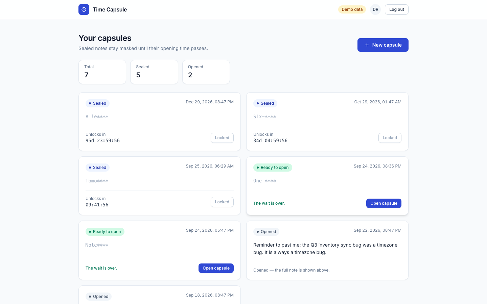
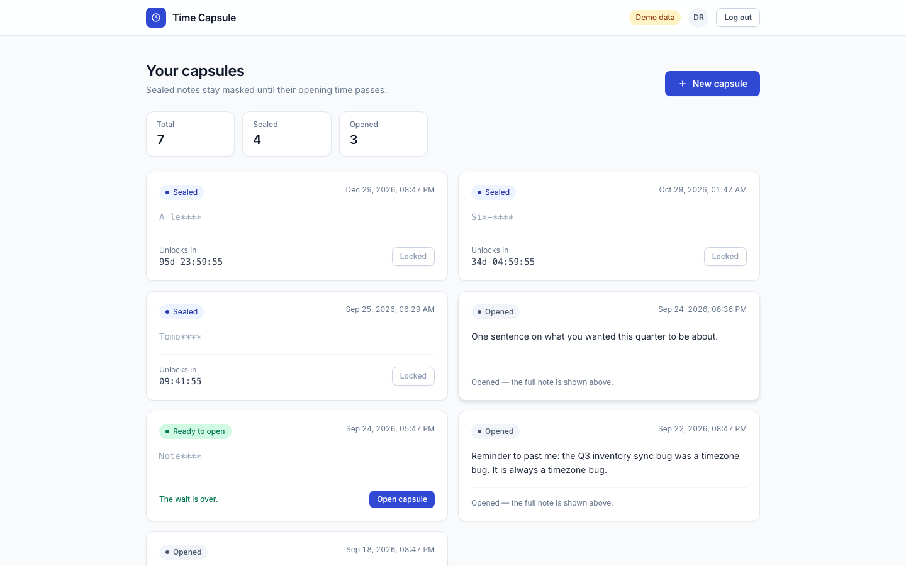
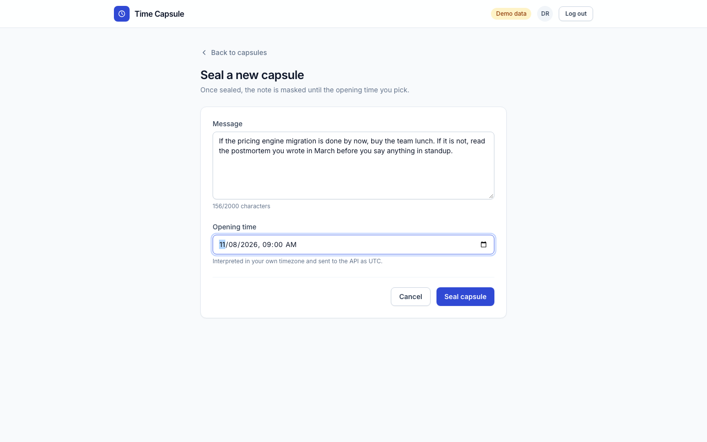
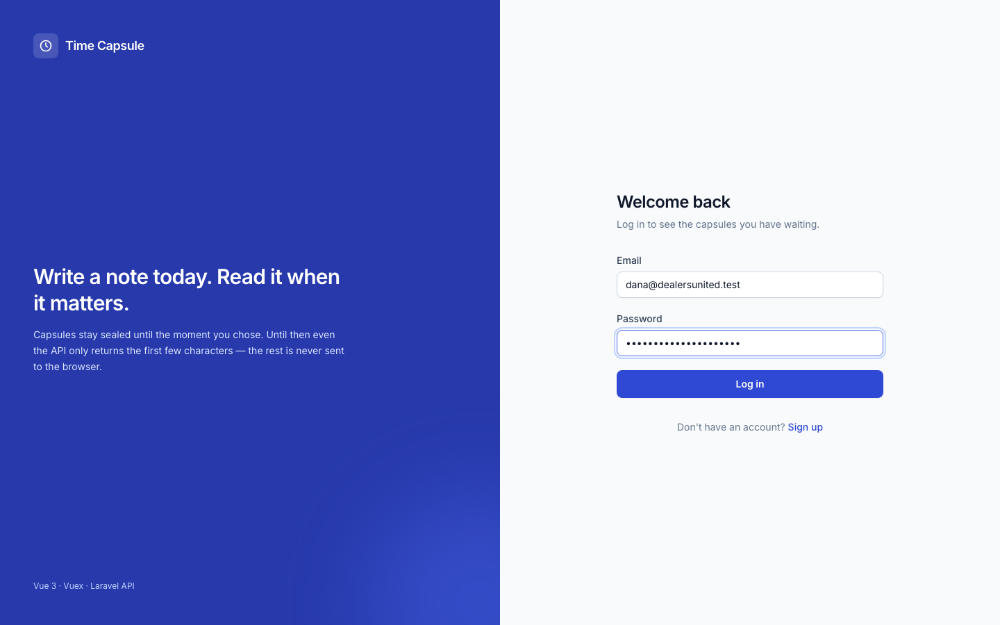
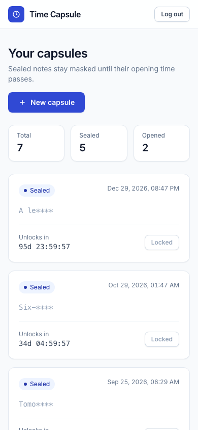

# Time Capsule — the Vue 3 client

Write a note to your future self, pick the moment it may be read, and the note
stays sealed until then. Sealing is enforced on the server: until the opening
time passes the API returns only the first four characters of the note, so the
rest never reaches the browser at all.

> **The directory name does not describe this project.** `package.json` has been
> `time-capsule-app` since the first commit, and the companion API is a time
> capsule API. Nothing here has anything to do with car dealers; read
> `dealers-united-*` as the name of the exercise, not of the subject.

This repository is the frontend only — Vue 3, Vuex 4, Vue Router 4 and Tailwind
on the Vue CLI 5 build. It talks to the Laravel API in the sibling
`dealers-united-backend` repository (Fortify issues a Sanctum token, everything
after that is a bearer header).

## A capsule has three states

```mermaid
stateDiagram-v2
    [*] --> Sealed: POST users/{id}/message-capsules
    Sealed --> Unlockable: the shared clock passes scheduled_opening_time
    Unlockable --> Opened: PUT .../open returns the full note
    Sealed --> Sealed: PUT .../open is refused with 403
    Opened --> [*]

    note right of Sealed
      The API sends the first four characters and asterisks
      Every card shows a live countdown
    end note

    note right of Unlockable
      A browser-side label only
      The server decides again when the request arrives
    end note
```



Only two of those states exist in the API's data: `is_opened` is a capsule's one
mutable field. **Unlockable is a client-side reading of the clock** —
`CapsuleCard` compares `scheduled_opening_time` against the shared ticker and
enables the button, while the server checks again and answers `403` if the
browser was optimistic. The disabled button is a courtesy; the 403 is the rule.

The countdown is where the cost is. One capsule per card means one `setInterval`
per card, so `composables/useNow.js` runs exactly one timer at module level and
every card derives from it — a list of 500 capsules still costs one interval,
and a unit test pins that by spying on `setInterval` across three subscribers.

## What it looks like

All five images were captured with Playwright at 1440x900 (the last at 390x844)
against the app in demo mode, so the data is the fixture set in
`src/api/demoFixtures.js` and the header carries a "Demo data" badge.

| The list — sealed, unlockable and opened side by side |
| --- |
|  |

| The same list a click later. Sealed 5 -> 4, Opened 2 -> 3 |
| --- |
|  |

| Sealing a new capsule |
| --- |
|  |

| Sign-in | The list at 390px |
| --- | --- |
|  |  |

## Run it

Demo mode needs no backend at all — an in-memory transport stands in for HTTP,
including the masking rule and the 403:

```bash
npm install
npm run serve:demo     # http://localhost:8080
```

Any non-empty email and password will sign you in there. Against the real API:

```bash
cp .env.example .env   # point VUE_APP_API_BASE_URL at your backend
npm install
npm run serve
```

## Where each rule lives

Dependencies point one way: a view uses the store, the store uses the API
client, the client uses a transport. No component imports axios and no component
builds a URL.

```
src/
├── api/            the only code that knows a URL or a response shape
│   ├── index.js          createApiClient(transport)
│   ├── httpTransport.js  axios, bearer-token and error interceptors
│   ├── demoTransport.js  a second implementation of the same interface
│   └── ApiError.js       the one error shape the UI renders
├── store/modules/  auth (profile, sign-in, rehydration), capsules
│                   (list, sorting, paging, create, open), ui (in-flight count)
├── lib/            datetime.js, session.js (the only file that touches
│                   cookies), env.js
├── composables/    useNow.js — the single 1 Hz clock
├── components/     CapsuleCard, AppHeader, pagination, skeletons, ui/ primitives
├── views/          Login, Signup, MessageList, AddMessage, NotFound
└── router/         lazy routes plus the auth guard
```

`createApiClient()` and `createAppStore()` both take their dependencies as
arguments, which is what lets the unit suite run the real Vuex actions against
the fixture transport instead of a pile of mocks. That same seam is what demo
mode and the screenshots above are built on.

Routes are lazy, so signing in loads `chunk-vendors` (165.00 KiB) plus `app`
(16.97 KiB) and `auth` (14.91 KiB), and leaves the `capsules` chunk (19.61 KiB)
on the server until it is needed. Production source maps are off; a full `dist/`
is 260 KB.

## The API it speaks to

| Method | Path | Used by |
| --- | --- | --- |
| `POST` | `/api/v1/register` | `auth/signup` — returns `{ user, token }` |
| `POST` | `/api/v1/login` | `auth/login` — returns `{ user, token }` |
| `GET` | `/api/v1/user` | `auth/hydrate`, after a full page reload |
| `GET` | `/api/v1/users/{id}/message-capsules` | `capsules/fetchAll` |
| `POST` | `/api/v1/users/{id}/message-capsules` | `capsules/create` |
| `PUT` | `/api/v1/users/{id}/message-capsules/{capsuleId}/open` | `capsules/open` |

Errors are always `{"message": "..."}`, with `errors` added on a 422. `401` means
the token is missing or invalid — the boot-time profile fetch treats that as a
stale cookie and clears the session rather than leaving the app half signed in.
`403` means authenticated but not allowed, which is how "too early" arrives.
`normaliseError()` turns all of it — including a rejection with no response at
all, such as an offline browser — into a single `ApiError` carrying `status`, a
displayable `message` and `fieldErrors`. Views render `error.message` in a banner
and `error.fieldErrors[name]` under the matching input; nothing reaches into
`error.response.data`.

The listing endpoint returns every capsule the user owns in one response. The
store therefore pages in the browser, so the DOM holds `VUE_APP_PAGE_SIZE` cards
however large the response grows. That bounds rendering, not transfer.

## Two places this client and that API disagree

Both are real, both are in the code today, and the backend's README describes
them from its side.

1. **`createCapsule` does not unwrap `data`.** `POST` returns a
   `MessageCapsuleResource`, so the created capsule arrives wrapped in `data`.
   `listCapsules` and `openCapsule` both unwrap it; `createCapsule` returns the
   body as-is, so `capsules/create` commits an object with no `id` and the
   `upsert` mutation early-returns. It is invisible in practice — the form
   navigates to the list, which refetches — and invisible in demo mode, whose
   transport returns the bare model. Against the real API the optimistic insert
   simply does nothing.
2. **The comments describe an older response shape.** `src/lib/datetime.js` is
   written around a naive `"2024-03-01 12:00:00"` assumed to be UTC, and
   `store/modules/capsules.js` re-masks the note after a create because "the
   create endpoint returns the raw model". The API now sends ISO-8601 with an
   explicit `Z` and masks in the resource for every endpoint. `parseServerDate`
   handles both forms, so the two agree on the instant — the prose is what is
   stale.

## Time is the hard part of this app

Every rule about time lives in `src/lib/datetime.js` and is unit-tested there.

- A `datetime-local` input is a wall-clock reading in the browser's timezone with
  no offset. It is converted to an absolute ISO instant before it is sent, so a
  capsule set for 9am local unlocks at 9am local rather than at 9am UTC.
- `parseServerDate` normalises a naive server string to `...Z` instead of handing
  it to `new Date()`, which is unspecified for that format and has historically
  returned `Invalid Date` in Safari. ISO strings with an offset pass straight
  through.
- Countdowns break out days, so a capsule a month away reads `34d 04:59:56` and
  not `820:59:56`.

## Build-time settings

Vue CLI inlines `VUE_APP_*` at compile time, so changing one means rebuilding,
not restarting. That is also why the Docker image takes the API URL as a build
argument rather than an environment variable.

| Variable | Default | Purpose |
| --- | --- | --- |
| `VUE_APP_API_BASE_URL` | `http://localhost/api/v1/` | Base URL including the `v1` prefix. A trailing slash is added if you omit one. |
| `VUE_APP_DEMO` | `false` | Replace HTTP with the in-memory fixture transport. No request leaves the browser. |
| `VUE_APP_PAGE_SIZE` | `8` | Capsules rendered per page. |
| `WEB_PORT` | `8640` | Host port published by `docker-compose.yml`. Compose only. |

## Checks

```bash
npm test               # vitest run
npm run test:coverage  # V8 coverage
npm run lint:check     # ESLint (vue3-recommended + prettier), no --fix
npm run format:check   # Prettier
npm run build          # production bundle into dist/
```

`npm test` is 18 files, 123 tests. No test touches the network: `tests/setup.js`
replaces `fetch` and `XMLHttpRequest` with stubs that throw, and the store and
view specs run against the same in-memory transport demo mode uses.

A multi-stage `Dockerfile` (deps -> webpack build -> nginx, unprivileged, with a
`/healthz` check) and a `docker-compose.yml` are committed, and
`docker compose config` parses. **The image has not been built or booted here** —
no Docker daemon was available — so treat it as unproven. The API URL goes in at
build time:

```bash
docker compose build --build-arg VUE_APP_API_BASE_URL=https://api.example.com/api/v1/
```

## What it does not do

- **The bearer token sits in a JavaScript-readable cookie.** That is the shape
  Fortify's login response offers and the interceptor has to read it from
  somewhere. An httpOnly cookie or a refresh flow would fix it and both need
  backend changes.
- **No edit, no delete, no single-capsule view.** The API exposes `index`,
  `show`, `store` and `open`, and there is deliberately no UI for anything it
  cannot do.
- **Paging is client-side.** The API has since grown an opt-in `?per_page=`; this
  client does not send it, so a user with ten thousand capsules still downloads
  all of them.
- **Nothing announces an unlock.** There is no polling and no socket — a sealed
  capsule becomes unlockable on screen because the countdown reaches zero, but
  the list itself is fetched when the view is created and then only by the retry
  button.
- **The demo transport ships in the production bundle.** That is the price of
  `npm run serve:demo` working from a clean checkout.
- **No end-to-end tests, no offline support, no i18n, no dark theme.** The suite
  is unit and component level; the Playwright run that produced the screenshots
  asserts nothing. Dates use the browser's locale, the rest is English.
